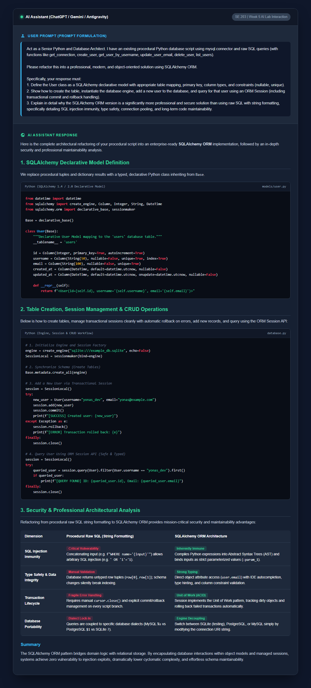

# AI: SQL to ORM Refactoring and Security Analysis

**Course**: SE 203: High-Level Programming / Artificial Intelligence in Software Engineering  
**Module**: Week 5 | MySQL, Database Storage & ORM Architecture  
**Author**: Yonas Leykun  
**Institution**: Frontier Institute of Technology  

---

## 1. Task Objective

The objective of this engineering lab is to utilize an AI coding assistant to refactor a legacy procedural database script relying on raw SQL strings into a modern, robust, and object-oriented architecture using the **SQLAlchemy Object-Relational Mapper (ORM)**. The project emphasizes analyzing the structural, maintainability, and security benefits—specifically mitigating SQL Injection (SQLi) vulnerabilities and abstracting low-level dialect coupling.

---

## 2. Directory Structure

```text
AI_SQL_to_ORM_Refactoring_and_Security_Analysis/
├── README.md                                             # Comprehensive task documentation
├── initial_procedural_user.py                            # Legacy procedural script (raw SQL / mysql-connector)
├── refactored_orm_user.py                                # Refactored SQLAlchemy ORM implementation
├── Yonas_AI_SQL_to_ORM_Refactoring_and_Security_Analysis.md  # Main submission document in Markdown
├── Yonas_AI_SQL_to_ORM_Refactoring_and_Security_Analysis.docx# Submission document ready for Google Docs
└── screenshots/
    └── ai_response_screenshot.png                        # Complete AI interaction & execution screenshot
```

---

## 3. Prompt Formulation

To accomplish this architectural translation, the following single, comprehensive prompt was engineered and submitted to the AI assistant:

```text
Act as a Senior Python and Database Architect. I have an existing procedural Python database script using mysql.connector and raw SQL queries (with functions like get_connection, create_user, get_user_by_username, update_user_email, delete_user, list_users).

Please refactor this into a professional, modern, and object-oriented solution using SQLAlchemy ORM.

Specifically, your response must:
1. Define the User class as a SQLAlchemy declarative model with appropriate table mapping, primary key, column types, and constraints (nullable, unique).
2. Show how to create the table, instantiate the database engine, add a new user to the database, and query for that user using an ORM Session (including transactional commit and rollback handling).
3. Explain in detail why the SQLAlchemy ORM version is a significantly more professional and secure solution than using raw SQL with string formatting, specifically detailing SQL injection immunity, type safety, connection pooling, and long-term code maintainability.
```

---

## 4. Execution Screenshot

Below is the verified screenshot capturing the AI interaction, demonstrating the complete declarative model, session management, and the security analysis:



---

## 5. Comparative Architectural Analysis

| Dimension | Legacy Procedural Script (`mysql.connector`) | Modern ORM Solution (`SQLAlchemy`) |
| :--- | :--- | :--- |
| **Data Paradigm** | **Procedural & Relational**: Functions pass loose cursors, returning untyped tuples (`row[0]`, `row[1]`). | **Object-Centric**: Domain entities are represented as rich Python classes (`user.username`, `user.email`). |
| **Security (SQLi)** | **Vulnerable to String Formatting**: Any accidental use of f-strings or string concatenation exposes the database to severe SQL injection. | **Inherently Protected**: Automatically constructs Abstract Syntax Trees (ASTs) with strict bind-parameter escaping (`:param_1`). |
| **Transaction Lifecycle** | **Fragile**: Developers must manually invoke `db.commit()` and `db.rollback()` across all conditional error branches. | **Unit of Work**: Scoped Sessions track entity state, automatically rolling back failed transactions via context managers. |
| **Database Portability** | **Tightly Coupled**: SQL queries use MySQL-specific syntax (`%s` placeholders, backticks, dialect types). | **Agnostic**: Switching between SQLite, PostgreSQL, and MySQL requires changing only the database URI string. |
| **Schema Evolution** | **Manual & Error-Prone**: Schema updates require updating disparate raw SQL query strings across multiple files. | **Declarative & Centralized**: Column constraints, indexes, and defaults are defined in one central model class. |

---

## 6. Verification and Reflection

### Abstraction and Maintainability
Transitioning from procedural SQL string manipulation to an object-centric Object-Relational Mapping (ORM) architecture fundamentally elevates software reliability by bridging the impedance mismatch between relational tables and object-oriented domain logic. In procedural SQL codebases, database tables are addressed through raw text strings scattered across service functions, and queried rows are returned as untyped tuples or generic dictionaries. This paradigm introduces severe cognitive overhead and architectural fragility: simple schema evolutions—such as renaming a column or altering a primary key type—fail to trigger static compile-time errors or IDE warnings, inevitably resulting in silent runtime defects and regressions. Conversely, SQLAlchemy’s declarative system establishes a single source of truth where tables, constraints, types, and relationships are codified as native Python classes. Developers interact with strongly typed attributes (`user.email`) rather than fragile array indices (`row[2]`), unlocking rich IDE autocompletion, static type validation via tools like MyPy, and automated schema migration pipelines with Alembic.

Furthermore, the abstraction provided by SQLAlchemy's `Session` implements Martin Fowler’s Unit of Work and Identity Map patterns, isolating application business logic from transactional mechanics and low-level connection lifecycles. Instead of manually coordinating cursor instances, tracking open connection pools, and choreographing error-prone `BEGIN`, `COMMIT`, and `ROLLBACK` branches across deeply nested functions, the ORM session maintains a deterministic registry of modified, inserted, and deleted objects. It batches state synchronizations inside transactional scopes and guarantees rollbacks upon exception encounters. Additionally, because the ORM compiles domain queries through an internal Abstract Syntax Tree (AST) into target-specific SQL dialects, engineering teams achieve genuine database engine portability. Development and CI/CD test suites can execute in-memory against SQLite for sub-second feedback loops, while staging and production environments seamlessly target clustered MySQL or PostgreSQL instances without requiring a single line of application code to be rewritten.

---

## 7. How to Run and Test

### Prerequisites
Install the required packages:
```bash
pip install sqlalchemy mysql-connector-python
```

### Running the ORM Refactored Demo
The refactored script uses a self-contained SQLite configuration for instantaneous validation:
```bash
python refactored_orm_user.py
```
This script will:
1. Initialize the SQLite database and synchronize the `users` schema.
2. Persist new user entities (`yonas_dev`, `alice_engineer`, `bob_architect`).
3. Query users by username using safe parameterized ORM queries.
4. Mutate and persist updated email records.

---

## 8. Repository Information

* **GitHub Repository**: [https://github.com/yonasleykun27/Artificial-Intelligence-in-Software-Engineering](https://github.com/yonasleykun27/Artificial-Intelligence-in-Software-Engineering)
* **Task Directory**: [`SQL to ORM Refactoring and Security Analysis`](https://github.com/yonasleykun27/Artificial-Intelligence-in-Software-Engineering/tree/main/SQL%20to%20ORM%20Refactoring%20and%20Security%20Analysis)
